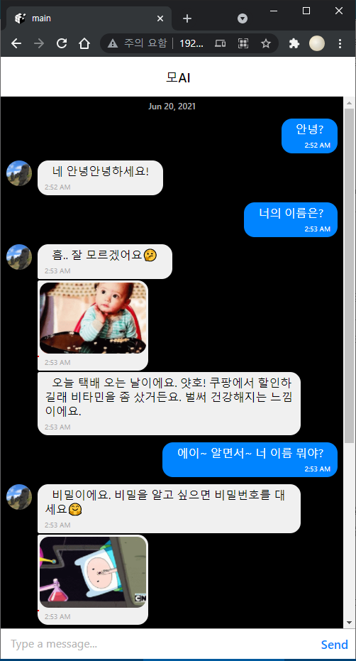

# TalkingMoAI-client

라즈베리파이를 활용한 모AI 일상대화 인공지능 설계 및 구현

## 개요

**주제** : 라즈베리파이를 활용한 자율주제
**내용** : 라즈베리파이를 활용한 모AI 일상대화 인공지능 설계 및 구현



실행화면1


실행화면2

### 세부기능유닛시나리오1

> 채팅을 입력하면 모AI의 리액션 텍스트 답변 및 확률적 화제 전환

[https://www.youtube.com/watch?v=efeLHFoqUbY](https://www.youtube.com/watch?v=efeLHFoqUbY)

### 세부기능유닛시나리오2

> 채팅을 입력하면 모AI의 확률적 리액션 이미지 답변

[https://youtu.be/6av7t7AHC-4](https://youtu.be/6av7t7AHC-4)

### 세부기능유닛시나리오3

> 채팅을 입력하면 모AI의 리액션 발화(TTS) 답변

[https://youtu.be/0xhaJVECrZE](https://youtu.be/0xhaJVECrZE)

### 통합 시나리오

> 채팅을 입력하면 TTS 및 텍스트 리액션 답변과,
> 확률적 화제전환 및 이미지 송신

[https://youtu.be/Ii4hLDFD3G0](https://youtu.be/Ii4hLDFD3G0)

---

## 개발 스택

### 공통

-   Axios
    -   브라우저 및 Node.js를 위한 Promise 기반 HTTP 클라이언트 입니다.

### 서버

-   NestJS
    -   효율적이고 안정적이며 확장 가능한 서버 측 애플리케이션을
        구축하기 위한 진보적인 Node.js 프레임워크 입니다.
-   Redis
    -   Redis는 데이터베이스, 캐시 및 메시지 브로커로 사용되는 오픈 소스(BSD 라이선스),
        인 메모리 데이터 구조 저장소입니다.
    -   TTS Queue 처리를 위해 사용됩니다.
-   MongoDB Cloud Atlas database service
    -   MongoDB는 크로스 플랫폼 도큐먼트 지향 데이터베이스 시스템입니다.
    -   MongoDB Atlas는 애플리케이션을 위한 글로벌 클라우드 데이터베이스 서비스입니다.
-   TypeORM
    -   Typescript 및 Javascript를 위한 ORM(객체 관계 매핑)입니다.
    -   MongoDB를 위해 사용됩니다.
-   Google Cloud Platform(GCP)
    -   구글 클라우드 플랫폼은 구글에서 개발한 클라우드 컴퓨팅 플랫폼 입니다.
    -   GCP의 TTS(Text-To-Speech) API를 사용하기 위해 사용됩니다.
-   Pingpong
    -   핑퐁 빌더는 손쉽게 친근하고 생동감 있는 인공지능을 만들 수 있도록 돕는 빌더입니다.

### 클라이언트

-   React Native
    -   React Native는 React 웹 프레임워크의 UI를 iOS, Android에 제공합니다.
-   Expo
    -   Expo는 JavaScript 및 React를 사용하여 Android, iOS 및 웹 범용 네이티브 앱을 만들기 위한 오픈 소스 플랫폼입니다.
-   Firebase
    -   Firebase는 고품질 앱을 빠르게 개발하고 비즈니스를 성장시키는 데 도움이 되는
        Google의 모바일 플랫폼입니다.
    -   익명 Authentication을 구현하기 위해 사용됩니다.

---

## 환경 설정

### 하드웨어

-   준비물 : Raspberry Pi 4 Model B, USB스피커, 모아이 휴지케이스


모AI 앞면


모AI 뒷면


모AI 내부


모AI 케이스 분리

### 서버

1. Git 설치
2. Node 설치 (LTS v14.17.1 설치 권장)

    ```bash
    $ curl -o- https://raw.githubusercontent.com/nvm-sh/nvm/v0.37.2/install.sh | bash
    $ source ~/.bashrc
    $ nvm install v14.17.1
    $ nvm use v14.17.1
    ```

3. Node Global Module 설치
    - NestJS 설치 : `npm install -g nest-cli`
4. redis 설치
    - `$ apt install -y redis-server`
    - 이후, conf를 설정하고 서비스를 실행해야할 수 있습니다. (`$ redis-server`)
5. TalkingMoAI server project 설치
    - `git clone [https://github.com/maemenaver/TalkingMoAI.git](https://github.com/maemenaver/TalkingMoAI.git)`
    - 프로젝트 디렉토리에 node_modules 설치 : `npm install`
6. Google Cloud Platform의 Cloud Text-to-Speech API 설정
    - 설정 후, 서비스 키를 프로젝트의 `./talkingmoai-8d4204346eed.json` 에 저장
7. Pingpong builder의 custom API 설정

    - 신규 유저의 custom API 사용을 위해 승인기간을 거쳐야 합니다.

        

    - 이미지셋 사용 빈도를 40%로 설정합니다.

        

    - 토픽 제시 빈도를 `자주`로 설정합니다.

        

8. MongoDB Cloud Atlas 설정
    - 프로젝트 생성 후, 클러스터 생성
9. 환경 변수 설정

    - `./env.developement.tmp` 파일 변경 후, `./env.development`의 이름으로 저장

        ```bash
        SERVER_PORT= # 서버포트. 예시: 3002
        REDIS_HOST= # 레디스 서버 IP. 예시: 127.0.0.1
        REDIS_PORT= # 레디스 서버 포트. 예시: 6379
        MONGO_USER= # MongoDB Cloud Atlas 서버 유저네임.
        MONGO_PASS= # MongoDB Cloud Atlas 서버 비밀번호.
        MONGO_HOST= # MongoDB Cloud Atlas 서버 호스트.
        PINGPONG_URL= # Pingpong builder custom API URL
        PINGPONG_AUTHORIZATION= # Pingpong API Authorization "Basic " 뒤의 문자
        ```

10. 서버 실행
    - 프로젝트 디렉토리에서 다음 명령어 실행 : `yarn start`

### 클라이언트

1. Git 설치
2. Node 설치 (LTS v14.17.1 설치 권장)

    ```bash
    $ curl -o- https://raw.githubusercontent.com/nvm-sh/nvm/v0.37.2/install.sh | bash
    $ source ~/.bashrc
    $ nvm install v14.17.1
    $ nvm use v14.17.1
    ```

3. Node Global Module 설치
    - yarn 설치 : `npm install -g yarn`
    - expo-cli 설치 : `yarn global add expo-cli`
4. TalkingMoAI client project 설치
    - `git clone [https://github.com/maemenaver/TalkingMoAI-client](https://github.com/maemenaver/TalkingMoAI-client)`
    - 프로젝트 디렉토리에서 다음 명령어로 node_modules 설치 : `yarn`
5. firebase 설정
    - 프로젝트 생성
    - Authentication의 Sign-In method 탭에서 익명 사용 설정
    - 앱 추가 후, 프로젝트 서비스 키 발급
    - `./firebase.tmp` 파일을 `./firebase.ts`로 복사하고 서비스 키 입력
6. `./src/lib/axiosInstance.ts` 에서 서버의 baseURL로 변경

    ```tsx
    ...
    export default function axiosInstance() {
        const instance = axios.create({
            baseURL: "http://192.168.0.31:3002", // Write baseURL
            timeout: 3000,
        });
    ...
    ```

7. 클라이언트 실행
    - 프로젝트 디렉토리에서 다음 명령어로 클라이언트 실행 : `yarn start`
    - cli에서 w키를 입력하면 클라이언트 web을 실행할 수 있습니다.
    - 다음 브라우저 주소로 접속하면 웹 앱에 접근 가능합니다. : `http://{ClientIP}:19006`

## 소스코드 설명

### 서버

-   `./src/app-module.ts` - 서버의 최상위 모듈

    -   `EnvironmentModule` : 환경 변수 불러오는 모듈
    -   `TypeOrmModule` : MongoDB를 위한 ORM 모듈
    -   `BullModule` : Queue를 구현하기 위한 모듈 (Redis에서 처리)
    -   `ConfigModule` : 모AI를 위한 주요 기능이 들어있는 모듈

    ```tsx
    ...
    @Module({
        imports: [
            EnvironmentModule.forRoot({
                envFilePath: `.env.${process.env.NODE_ENV}`,
                isGlobal: true,
            }),
            ScheduleModule.forRoot(),
            TypeOrmModule.forRoot({
                name: "mongo",
                type: "mongodb",
                url: `mongodb+srv://${process.env.MONGO_USER}:${process.env.MONGO_PASS}@${process.env.MONGO_HOST}`,
                database: "saruru",
                entities: [User, Config],
                ssl: true,
                useUnifiedTopology: true,
                useNewUrlParser: true,
                keepConnectionAlive: true,
            }),
            BullModule.forRoot({
                redis: {
                    host: process.env.REDIS_HOST,
                    port: Number(process.env.REDIS_PORT),
                },
            }),
            UsersModule,
            ConfigModule,
        ],
    ...
    ```

-   `./src/config/config-module.ts` - 모AI를 위한 주요 기능이 들어있는 모듈

    -   `BullModule.registerQueue` : `meeting`이라는 이름의 Queue 등록
    -   `ConfigController` : REST API를 만들기 위한 컨트롤러
    -   `ConfigService` : Config Module의 서비스
    -   `ConfigProcessor` : Queue를 위한 프로세서

    ```tsx
    ...
    @Module({
        imports: [
            BullModule.registerQueue({
                name: "meeting",
                defaultJobOptions: {
                    removeOnComplete: true,
                },
            }),
            UsersModule,
            HttpModule,
        ],
        controllers: [ConfigController],
        providers: [ConfigService, ConfigProcessor],
        exports: [ConfigService],
    })
    export class ConfigModule {}
    ```

-   `./src/config/config-controller.ts` - REST API를 만들기 위한 컨트롤러

    -   `POST /config/tts` : 사용자의 메시지를 처리하고 답변을 return 합니다.
        -   application/json Body
            -   userID : 클라이언트의 firebase auth user.uid를 받습니다. (세션 식별)
            -   message : 사용자가 보낸 메시지를 받습니다.

    ```tsx
    ...
    @Post("tts")
        async tts(@Body() { message, userID }) {
            try {
                if (!message || !userID) {
                    throw new HttpException(
                        "Not found query",
                        HttpStatus.BAD_REQUEST
                    );
                }

                // pingpong 서버로 메시지를 보냅니다.
                // 리액션 메시지 및 이미지을 반환합니다.
                const pingpong = await this.httpService
                    .post(
                        `${process.env.PINGPONG_URL}/${userID}`,
                        {
                            request: {
                                query: message,
                            },
                        },
                        {
                            headers: {
                                Authorization: `Basic ${process.env.PINGPONG_AUTHORIZATION}`,
                                "Content-Type": "application/json",
                            },
                        }
                    )
                    .toPromise();

                let resultPingpong = [];

                // 메시지의 개수 만큼 처리합니다.
                for (let i = 0; i < pingpong.data.response.replies.length; i++) {
                    // 해당 메시지의 type을 확인합니다.
                    const type = pingpong.data.response.replies[i].type;
                    switch (type) {

                        // type이 text일 경우
                        case "text":
                            // type과 text를 resultPingpong array에 추가합니다.
                            const text = pingpong.data.response.replies[i].text;
                            resultPingpong = [...resultPingpong, { type, text }];

                            // TTS 서비스 함수를 호출합니다.
                            this.configService.textToSpeech(text);
                            break;

                        // type이 image일 경우
                        case "image":
                            // type과 (image)url을 resultPingpong array에 추가합니다.
                            const url = pingpong.data.response.replies[i].image.url;
                            resultPingpong = [...resultPingpong, { type, url }];
                            break;
                    }
                }

                console.log(resultPingpong);

                // 클라이언트로 resultPingpong obejct[]를 전송합니다
                return resultPingpong;
            } catch (err) {
                console.error(err);
                throw err;
            }
        }
    ...
    ```

-   `/src/config/config-service.ts` : config 모듈의 서비스

    -   `textToSpeech` : TTS 처리를 위한 Queue를 추가합니다.

    ```tsx
    ...
    async textToSpeech(message: string) {
            console.log("tts service test");

            const result = this.configQueue.add("textToSpeech", {
                message,
            } as TTSDataDto);
            return result;
        }
    ...
    ```

-   `/src/config/config-processor.ts` : meeting Queue 처리 프로세서

    -   `textToSpeech` : TTS를 처리합니다.
        -   의도
            -   Queue를 활용하지 않으면 소리가 중복되서 재생됩니다.
            -   중복현상을 방지하고 순차적으로 처리하기 위해 Queue를 사용했습니다.

    ```tsx
    ...
    @Process("textToSpeech")
        async textToSpeech(job: Job) {
            try {
                // 처리할 메시지를 가져옵니다.
                const { message }: TTSDataDto = job.data;

                console.log("tts Test");

                // Google Cloud Platform에 보낼 request값을 정의합니다.
                const request: textToSpeech.protos.google.cloud.texttospeech.v1.ISynthesizeSpeechRequest = {
                    input: { text: message },
                    voice: {
                        languageCode: "ko-KR",
                        name: "ko-KR-Wavenet-C",
                    },
                    audioConfig: {
                        effectsProfileId: ["small-bluetooth-speaker-class-device"],
                        audioEncoding: "LINEAR16",
                    },
                };

                // Google Cloud Platform TextToSpeechClient 객체를 선언합니다.
                const client = new textToSpeech.TextToSpeechClient({
                    // Google Cloud Platform 인증 키를 가져옵니다.
                    keyFilename: "./talkingmoai-8d4204346eed.json",
                });

                // TTS request를 서버에 보내고 결과를 받습니다.
                const [response] = await client.synthesizeSpeech(request);

                // 가져온 TTS response의 오디오를 output.wav로 저장합니다.
                const writeFile = util.promisify(fs.writeFile);
                await writeFile("output.wav", response.audioContent, "binary");

                console.log("Audio content written to file: output.wav");

                // output.wav 사운드 파일을 재생합니다.
                const player = require("node-wav-player");
                await player.play({ path: "./output.wav", sync: true });
            } catch (err) {
                console.error(err);
                throw err;
            }
        }
    ...
    ```

### 클라이언트

-   `./src/container/Talking/TalkingChatContainer.tsx` : 채팅 화면을 렌더링 합니다.

    ```tsx
    ...
    export default function TalkingChatContainer() {
        // 내 정보의 default를 정의합니다.
        const [myProfile, setMyProfile] = useState({
            _id: "",
            name: "",
            avatar: "",
        });

        // text의 default, ""를 정의합니다.
        const [text, setText] = useState("");

        // chat의 default를 정의합니다.
        const [chat, setChat] = useState({
            step: 0,
            messages: [] as IMessage[],
            isTyping: false,
            loadEarlier: true,
            isLoadingEarlier: false,
        });

        // 메시지를 보냈을 때 호출되는 함수입니다.
        // currentMessages : 입력한 메시지를 파라미터로 받습니다.
        async function onSend(currentMessages = []) {
            // 지금까지 입력된 메시지를 가져옵니다.
            let messages = [...chat.messages];

            // 내가 보낸 메시지의 정보를 반영합니다.
            const newMessage = [
                {
                    // 메시지 보낸 시각
                    createdAt: new Date(),

                    // 메시지의 ID
                    _id: currentMessages[0]._id,

                    sent: false,
                    received: false,

                    // 메시지의 text
                    text: currentMessages[0].text,

                    // 메시지의 유저 정보
                    user: myProfile,
                },
            ];

            // 메시지를 반영합니다.
            messages = GiftedChat.append(messages, newMessage, true);
            setChat({ ...chat, messages, step: chat.step + 1 });

            // 메시지를 보냅니다.
            TalkingChatSend(currentMessages[0].text, myProfile._id).then(
                // 결과값을 불러옵니다.
                (newData) => {
                    // 결과값이 없으면 서버 연결 실패를 알립니다.
                    if (!newData) {
                        newData = [{}];
                        newData[0].type = "text";
                        newData[0].text = "모AI 서버와 연결을 실패했습니다.";
                    }

                    // 결과의 array 순서대로 확인합니다.
                    for (let i = 0; i < newData.length; i++) {
                        // 결과 메시지의 정보를 선언합니다.
                        const newMessage = [
                            {
                                createdAt: new Date(),
                                _id: `${+new Date() + 1 + i}`,
                                sent: false,
                                received: false,
                                text: newData[i].type == "text" && newData[i].text,
                                image: newData[i].type == "image" && newData[i].url,
                                user: {
                                    _id: `MoAI`,
                                    name: `모AI`,
                                    avatar:
                                        "https://upload.wikimedia.org/wikipedia/commons/thumb/a/a2/Moai_Rano_raraku.jpg/1200px-Moai_Rano_raraku.jpg",
                                },
                            },
                        ];

                        // 메시지를 반영합니다.
                        messages = GiftedChat.append(messages, newMessage, true);
                    }

                    // 메시지를 반영합니다.
                    setChat({
                        ...chat,
                        messages,
                        step: chat.step + messages.length - 1,
                    });
                }
            );
        }

        // useEffect Hook을 이용해
        // 컴포넌트가 렌더링 이후에 어떤 일을 수행해야 하는지 알려줍니다.
        useEffect(() => {
            // firebase config을 불러와서 초기화 합니다.
            firebase.initializeApp(firebaseConfig);
            // firebase 익명 로그인을 시도합니다.
            firebase
                .auth()
                .signInAnonymously()
                // 성공하면 다음 익명 함수를 호출합니다.
                .then(() => {
                    // user.uid를 저장합니다.
                    firebase.auth().onAuthStateChanged((user) => {
                        if (user) {
                            const profile = {
                                _id: user.uid,
                                name: "나",
                                avatar: "https://picsum.photos/250/250",
                            };

                            setMyProfile(profile);
                        }
                    });
                })
                // 실패하면 다음 익명 함수를 호출합니다.
                .catch((err) => {
                    console.error(err);
                });
        }, []);

        return (
            // 채팅 화면을 렌더링합니다.
            <TalkingChat
                myProfile={myProfile}
                chat={chat}
                text={text}
                setText={setText}
                onSend={onSend}
            />
        );
    }
    ```

-   `/src/lib/Talking/chatSend.ts` : 채팅을 전송합니다.

    -   주소 : `POST /config/tts`

    ```tsx
    ...
    export default async function TalkingChatSend(message, userID) {
        const instance = axiosInstance();

        return await instance({
            url: "/config/tts",
            method: "POST",
            data: {
                message,
                userID,
            },
        })
            .then((res) => {
                return res.data;
            })
            .catch((err) => {
                return null;
            });
    }
    ```
